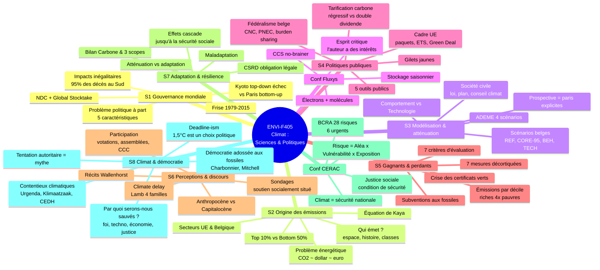
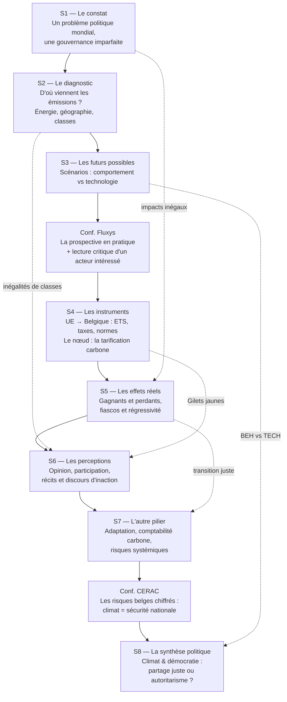

# ENVI-F405 — Vue globale du cours

> [!abstract] Le cours en une phrase
> **Le climat est une question politique avant d'être une question technique.** Le fil conducteur : climat → énergie → économie → mode de vie. Des solutions existent, mais leur mise en œuvre crée des **gagnants et des perdants** — c'est précisément ce qui en fait un objet _politique_. La question finale du cours : **le défi climatique est-il soluble dans la démocratie ?**

---

## 🗺️ Carte mentale du cours

---

## 📖 Le fil narratif (comment les séances s'enchaînent)

---

## 🧵 Les 5 fils conducteurs transversaux

Ces thèmes reviennent dans (presque) toutes les séances — ce sont probablement les angles d'examen les plus payants.

### 1. Le climat révèle et amplifie les inégalités
- **S1** : 95 % des décès dans les pays en développement ; pertes économiques vs mortalité.
- **S2** : Top 10 % nord-américain ≈ 73 t/an, 70× les pauvres d'Asie du Sud ; responsabilité historique occidentale.
- **S5** : décile riche belge émet 4× le pauvre, mais les politiques (CV, primes, taxes) sont souvent **régressives**.
- **S6** : le soutien à la taxe carbone est socialement situé ; biais de classe des discours verts.
- **S7/CERAC** : les vulnérables subissent le plus ; *« la justice sociale climatique est une condition de sécurité nationale »*.
- **S8** : l'acceptabilité dépend d'un **partage juste** (sondage ADEME, 66 %).

### 2. Comportement vs technologie (sobriété vs techno-solutionnisme)
- **S3** : scénarios BEH vs TECH ; ADEME S1 (frugalité) vs S4 (pari réparateur).
- **Fluxys** : un acteur industriel qui penche structurellement côté techno/infrastructure.
- **S6** : croissance verte vs décroissance ; critique de la « managérialisation ».
- **S8** : les 3 scénarios d'atténuation (optimisme irrationnel / croissance verte / post-croissance).

### 3. Réformiste vs révolutionnaire
- **S4** : le Green Deal comme politique *réformiste* (ne touche pas aux structures).
- **S5** : les mesures remettent-elles en cause le modèle dominant ou l'aménagent-elles ?
- **S6** : l'axe structurant de l'analyse des discours.
- **S8** : Colmant — « le capitalisme néolibéral n'est plus compatible avec le défi climatique ».

### 4. Fin du monde vs fin du mois (justice = condition d'acceptabilité)
- **S4** : Gilets jaunes — une taxe techniquement correcte échoue sans contrat social.
- **S5** : 2022, l'État subventionne massivement les fossiles (~0,9 % du PIB) pour le pouvoir d'achat.
- **S6** : titre de la séance ; votations suisses (oui au climat tant que ça ne coûte pas).
- **S4** : le carbon dividend rend la taxe **progressive** → la redistribution est la clé.

### 5. L'esprit critique face aux chiffres et aux scénarios
- **S3** : un scénario est un **pari** ; la prospective rend les paris explicites.
- **Fluxys** : lire un modèle en connaissant **les intérêts de son auteur**.
- **S5** : impossibilité d'**isoler** l'effet d'une politique (Covid vs politique climatique).
- **S6** : grille de Lamb — décoder les discours de retardement.
- **S8** : **deadline-ism** — 1,5/2 °C sont des choix politiques, pas des seuils scientifiques.

---

## 📚 Récapitulatif des séances

| # | Séance | Thèse en une ligne | Concept-pivot |
|---|--------|--------------------|---------------|
| 1 | [[1. Réchauffement global, événements climatiques extrêmes , Gouvernance climatique mondiale\|S1 Gouvernance mondiale]] | Le climat est un problème politique aux impacts inégalitaires | Kyoto (top-down) vs Paris (bottom-up) |
| 2 | [[2. L’origine économique et politique des émissions de gaz à effet de serre\|S2 Origine des émissions]] | Problème climatique = problème énergétique ; CO₂ ~ $ ~ € | **Équation de Kaya** |
| 3 | [[3. Modélisation des émissions et mesures d’atténuation\|S3 Modélisation]] | La neutralité 2050 est possible, chaque choix est un pari | BEH vs TECH |
| — | [[3.  Conférence Fluxys\|Conf. Fluxys]] | Neutralité 2050 = électrons + molécules | Stockage saisonnier ; biais de l'émetteur |
| 4 | [[4. Analyse critique des politiques publiques ‘climatiques’\|S4 Politiques publiques]] | Entre objectif et résultat : des outils difficiles à rendre justes | Tarification carbone ; double dividende |
| 5 | [[5. Analyse des gagnants et perdants des politiques climatiques\|S5 Gagnants/perdants]] | Toute mesure crée gagnants et perdants | Crise des certificats verts |
| 6 | [[6. Perception publique de l’enjeu climatique et analyse des discours\|S6 Discours]] | Les mots ne sont pas neutres | Climate delay (Lamb) |
| 7 | [[7. Adaptation & Résilience\|S7 Adaptation]] | Agir, c'est compter ; risques systémiques | 3 scopes ; maladaptation |
| — | [[7. Conference BCRA (CERAC)\|Conf. CERAC]] | Climat = enjeu de sécurité nationale | Risque = Aléa × Vulnérabilité × Exposition |
| 8 | [[8. Bouleversements climatiques et bouleversements politiques. Conclusion\|S8 Climat & démocratie]] | La démocratie libérale est adossée aux fossiles | Carbon Democracy ; deadline-ism |

---

## 🔑 Les formules et cadres à connaître par cœur

> [!important] Les incontournables
> - **Équation de Kaya** : $CO_2 = POP \times \frac{PIB}{POP} \times \frac{E}{PIB} \times \frac{CO_2}{E}$ (S2)
> - **Risque = Aléa × Vulnérabilité × Exposition** (CERAC)
> - **Cap and trade** : plafond → rareté → marché → réduction au moindre coût (S4)
> - **Atténuation** (cause) vs **Adaptation** (conséquences) (S7)
> - **Scopes 1/2/3** : direct / énergie achetée / reste de la chaîne de valeur (S7)
> - **Kyoto vs Paris** : top-down contraignant échoué vs bottom-up universel non contraignant (S1)
> - **Les 4 familles de climate delay** de Lamb : autres / marginal / coûts / capitulation (S6)
> - **Les 7 critères d'évaluation** d'une politique (S5)
> - **Les 5 outils publics** : info, incitants, normes, quotas, signal-prix (S4)

> [!tip] Les chiffres qui marquent (à replacer à l'examen)
> - Trajectoire actuelle : **~+2,6 °C** (CAT) ; objectif Paris 1,5 °C hors d'atteinte (S1)
> - **95 %** des décès des catastrophes 1970-2008 dans les pays en développement (S1)
> - Top 10 % nord-américain : **73 t CO₂e/an** (S2)
> - Belgique : transport **~25 %**, industrie **~44 %** des émissions (S2)
> - ETS2 à 45 €/t : **+150 €/an** de facture gaz pour un ménage moyen (S4)
> - Solwatt : **~184 €/MWh** de soutien vs éolien **~46** — 4× plus cher (S5)
> - Décile riche belge : **16,5 t** vs décile pauvre **4 t** (S5)
> - Inondations 2021 : **39 morts, 5,2 Md€** (CERAC)
> - BCRA : **28 risques, 6 urgents**, 0 « très avancé » en préparation (CERAC)
> - CCC France : **12 %** des propositions reprises intégralement (S6)

---

> [!summary] Si tu ne retiens qu'une chose
> Le cours raconte une seule histoire : **un problème physique (S1-S2) a des solutions connues (S3) mais leur mise en œuvre (S4) crée des perdants (S5), se joue dans les mots (S6), exige de s'adapter (S7) — et pose finalement la question du contrat démocratique lui-même (S8)**. La réponse du prof : pas de transition sans **partage juste**, et méfiance envers les solutions miracles comme envers la tentation autoritaire.
